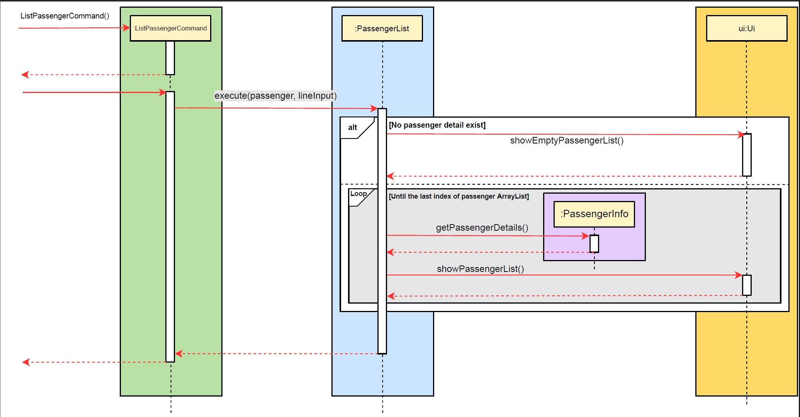
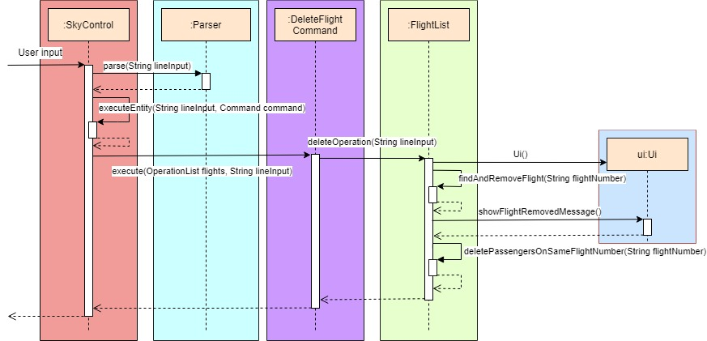

# Developer Guide

- [Acknowledgements](#Acknowledgements)
- [Design](#Design)
  1. [Architecture](#Architecture)
  2. [Ui component](#Ui-component)
  3. [Logic component](#Logic-component)
  4. [Model component](#Model-component)
  5. [Storage component](#Storage-component)
  6. [Common classes](#Common-classes)
- [Implementation](#Implementation)
- [Product scope](#Product scope)
- [Target user profile]()
- [Value proposition]()
- [User Stories]()
- [Non-Functional Requirements]()

## Acknowledgements

* The code package command was inspired by a similar package of [@ivanthengwr](https://github.com/ivanthengwr)'s 
[command package](https://github.com/ivanthengwr/ip/tree/master/src/main/java/duke/command) in his ip. 
* The style of document in for the developer guide is inspired by the DG of
[AY2122S1-CS2113T-T10-3](https://github.com/AY2122S1-CS2113T-T10-3/tp/blob/master/docs/DeveloperGuide.md#purpose-of-this-guide)

## Design
### Architecture
### Ui component
### Logic component
### Model component
### Storage component
### Common classes

## Implementation

This section would focus on explaining the application flow and the specifics on how the features are implemented.

List of Commands

The following sequence diagrams to showcase the list of commands, 
parser() method will not be reflected in order to improve readability.

1. [Delete a passenger feature](#Delete-a-passenger-feature)
2. [List passengers feature](#List-passengers-feature)
3. [Delete a flight](#Delete-a-flight-feature)

---

### Delete a passenger feature 

  

A delete function that removes a passenger's detail from the passenger's log book is 
facilitated by `DeletePassengerCommand`. It extends an abstract `Command` with an override method called `execute`.
The abstract `Command` extends a `Parser` which holds and validates the User input to determine the type of command.  

  

Furthermore, `DeletePassengerCommand` implements the following operation:  
* `execute(OperationList passengers, String lineInput)` &#8594; An override method inherited from `command` 
to execute the delete operation that should remove a passenger from the logbook  

  
The class diagram as depicted below shows the behaviour of the passenger delete operation explained in two parts.  
This scenario assumes that the manager have input a valid `passenger delete` command for easier readability.  

  

Part 1: 
* The valid `passenger delete` command is passed as a `String lineInput` into the function `parse` to valid 
the type of command that needs to be executed.
* Once validated, a new Command called `DeletePassengerCommand` should be instantiated.

Part 2:
* `DeletePassengerCommand` would then call `execute(passengers, lineInput)`, 
associating itself with PassengerList to obtain the existing `ArrayList<FlightInfo> passengers`.
* From there, `deleteOperation` method would run within method `execute` and terminate only when there is no such passenger
found or when a passenger is removed.

**Sequence diagram**

When `paser` verifies that the command is an entity `passenger` and `delete` operation,
`DeletePassengerCommend` is instantiated.  
1. `execute(passenger, lineInput)` will run within `DeletePassengerCommend` 
which in turn would call on `deleteOperation(passengerDetail)` in `PassengerList` class.
2. Within `deleteOperation(passengerDetail)`, it would loop the arraylist `passengers` obtained from `OperationList`.
3. If passenger is found, delete object `passenger` from `passengers`. ELse, return without deletion.

---

### List passengers feature

  

A list function lists out all passengers' details in table form which is facilitated by `ListPassengerCommand`. It extends an abstract `Command` with an override method called `execute`.
The abstract `Command` extends a `Parser` which holds and validates the User input to determine the type of command.

  

Furthermore, `ListPassengerCommand` implements the following operation:
* `execute(OperationList passengers, String lineInput)` &#8594; An override method inherited from `command` 
to execute the list operation that should list out all the passengers from the logbook.

  
The class diagram as depicted below shows the behaviour of the passenger list operation explained in two parts.  
This scenario assumes that the manager have input a valid `passenger list` command for easier readability.  

Part 1:  

* The valid `passenger list` command is passed as a `String lineInput` into the function `parse` to valid
  the type of command that needs to be executed.
* Once validated, a new Command called `ListPassengerCommand` should be instantiated.  

  

Part 2:  

* `ListPassengerCommand` would then call `execute(passengers, lineInput)`,
  associating itself with PassengerList to obtain the existing `ArrayList<FlightInfo> passengers`.
* From there, `listOperation` method would run within method `execute` and
prints out all `passengers` details on a table format.

**Sequence diagram**

  

When `paser` verifies that the command is an entity `passenger` and `list` operation,
`ListPassengerCommend` is instantiated.  
1. `execute(passenger, lineInput)` will run within `ListPassengerCommend`
   which in turn would call on `listOperation()` in `PassengerList` class.
2. Within `listOperation()`, it would first check if arraylist `passengers` obtained 
from `OperationList` is empty or not.
3. If `passengers` is empty, prints empty table, else prints respective passenger details in table form.

---
### Delete a flight feature

A delete function which allows the user to delete a flight specified with its flight number and
departure time from the flight list.

This feature is facilitated by `DeleteFlightCommand`. It extends an abstract `Command` with an override
method `execute`. The abstract `Command` extends a `Parser` which holds and validates the User input
to determine the type of command.

`DeleteFlightCommand` implements the following operation:
* execute(OperationList flights, String lineInput) &#8594; An override method inherited from
`command` to execute the delete operation that should delete the specified flight from the logbook.

The sequence diagram shown below describes the behaviour of the flight delete operation. This scenario
assumes that the manager has given a valid 'flight delete' command as an input for easier readability.

**Sequence Diagram**

Assuming that the manager has entered a valid 'flight delete' command, `parser()` will verify that the command
is an entity `flight` and a `delete` operation. `executeEntity()` runs within SkyControl which will
create an instantiation of `DeleteFlightCommand`.

1. `execute(flights, lineInput)` will run within `DeleteFlightCommand` which calls
`deleteOperation(lineInput)` in `FlightList` class.
2. Within `deleteOperaton(lineInput)`, it will check whether the flight number given is valid or not.
3. Given a valid flight number, `findAndRemoveFlight(flightNumber)` will search through the entire arraylist `flights`
to find if the flight number exists and remove it from the arraylist.
4. Upon successful deletion, `showFlightRemovedMessage()` is called which prints a message to the user to indicate a successful
delete operation

## Product scope
### Target user profile

{Describe the target user profile}

### Value proposition

{Describe the value proposition: what problem does it solve?}

## User Stories

|Version| As a ... | I want to ... | So that I can ...|
|--------|----------|---------------|------------------|
|v1.0|new user|see usage instructions|refer to them when I forget how to use the application|
|v2.0|user|find a to-do item by name|locate a to-do without having to go through the entire list|

## Non-Functional Requirements

{Give non-functional requirements}

## Glossary

* *glossary item* - Definition

## Instructions for manual testing

{Give instructions on how to do a manual product testing e.g., how to load sample data to be used for testing}
